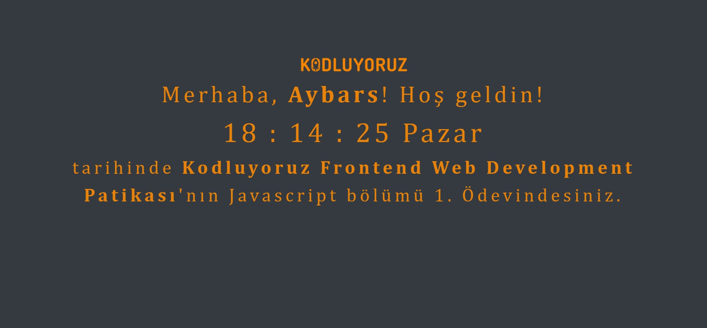

# Kodluyoruz - JavaScript Ödev 1
## JavaScript Clock 
Ödev Görseli ;



## About Project
Bu repo, [Kodluyoruz](https://kodluyoruz.org) Front-End Eğitiminde oluşturduğum ilk javascript ödevim.

Projemde sayfa açılışında kullanıcı adı istiyor ve bu adla birlikte ana ekranda anlık saati ve günü gösteriyor.

## Installation
Projeyi klonlayarak kullanabilirsiniz. 
```
https://github.com/aybarsumur/javascript-clock.git
```
